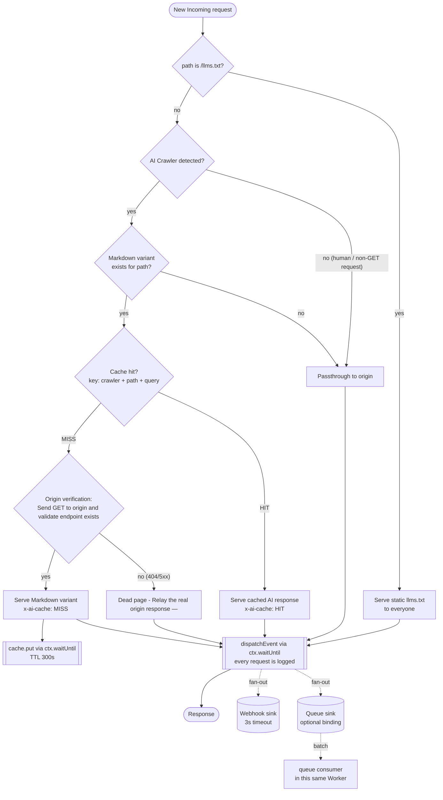
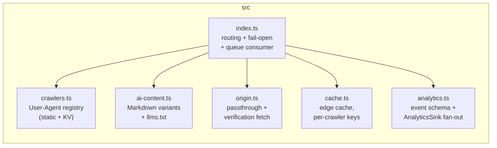

# Architecture

Cloudflare Worker deployed on the zone route in front of
`www.aisearchadvertising.com`. It detects AI crawlers, serves them an
origin-verified, edge-cached Markdown variant, and ships request events to
pluggable analytics sinks — while human traffic streams through untouched.

## Request flow

Fail-open wraps everything above: any unexpected error in the handler falls
back to a transparent passthrough to the origin; only an unreachable origin
yields a 502.

## Modules

| Module | Owns | Never does |
|---|---|---|
| `index.ts` | Request orchestration, fail-open catch, queue consumer | Business logic |
| `crawlers.ts` | Crawler registry + detection | I/O |
| `ai-content.ts` | Markdown variants, `llms.txt`, cache-safety headers | Network calls |
| `origin.ts` | Passthrough + origin verification | Response mutation |
| `cache.ts` | `caches.default` access, cache keys, HIT/MISS marking | Throwing (best-effort by design) |
| `analytics.ts` | Event schema, sink implementations | Blocking or breaking a response |
