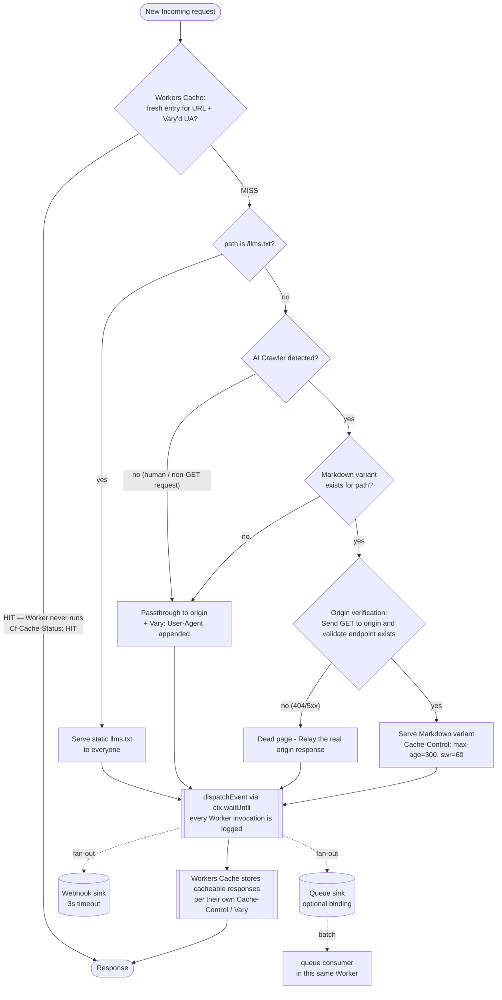
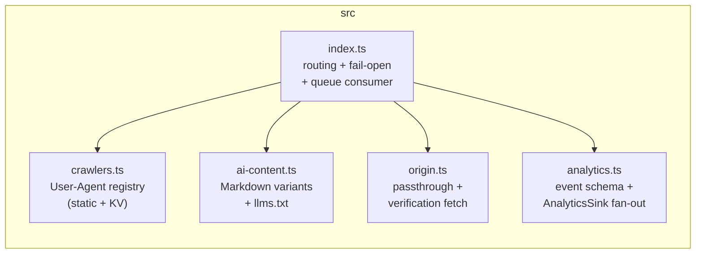

# Architecture

Cloudflare Worker deployed on the zone route in front of
`www.aisearchadvertising.com`. It detects AI crawlers, serves them an
origin-verified, edge-cached Markdown variant, and ships request events to
pluggable analytics sinks — while human traffic streams through untouched.

Caching is handled by **Workers Cache** (`[cache] enabled = true` in
[wrangler.toml](wrangler.toml)): a cache that sits *in front of* the Worker.
Fresh hits are answered before the Worker runs, and cacheability is driven
entirely by the `Cache-Control` / `Vary` headers on responses — see
[Workers Cache](#workers-cache) below.

## Request flow

Fail-open wraps everything above: any unexpected error in the handler falls
back to a transparent passthrough to the origin; only an unreachable origin
yields a 502.

## Workers Cache

The Worker itself contains no cache code — it is the miss handler. Fresh
hits are served without invoking it (zero CPU billed), and concurrent
requests for the same key collapse into a single invocation. What each
response declares:

| Response | Cache-Control | Vary | Cache-Tag |
|---|---|---|---|
| AI Markdown variant | `public, max-age=300, stale-while-revalidate=60` | `User-Agent` — one variant per crawler UA | `ai-variant` |
| `/llms.txt` | `public, max-age=3600, stale-while-revalidate=60` | none — identical bytes for everyone | `llms-txt` |
| Origin passthrough | whatever the origin declared | origin's, plus `User-Agent` appended by the Worker | — |

Why `Vary: User-Agent` everywhere: every URL on this zone is
User-Agent-negotiated (crawlers get Markdown, humans get HTML). A cacheable
origin page stored *without* `Vary` would match any later request —
including a crawler's — and silently bypass the AI variant. Crawler UAs are
stable, so crawler traffic hits reliably; diverse human UAs mostly miss
through to the origin, which matches the previous behavior.

Invalidation: cache keys include the Worker version, so deploys never serve
stale content; for manual purges, entries carry `Cache-Tag` headers,
purgeable with `ctx.cache.purge({ tags: ['ai-variant'] })`.

Observability: front-cache hits never invoke the Worker, so they don't reach
the analytics sinks — hit/miss ratios live in the Workers Observability
dashboard, and clients see the outcome on `Cf-Cache-Status`. Note:
`wrangler dev` does not simulate the front cache; locally, every request
invokes the Worker.

## Modules

| Module | Owns | Never does |
|---|---|---|
| `index.ts` | Request orchestration, fail-open catch, queue consumer | Business logic |
| `crawlers.ts` | Crawler registry + detection | I/O |
| `ai-content.ts` | Markdown variants, `llms.txt`, cache-safety headers | Network calls |
| `origin.ts` | Passthrough + origin verification | Response mutation (beyond the `Vary: User-Agent` append) |
| `analytics.ts` | Event schema, sink implementations | Blocking or breaking a response |
