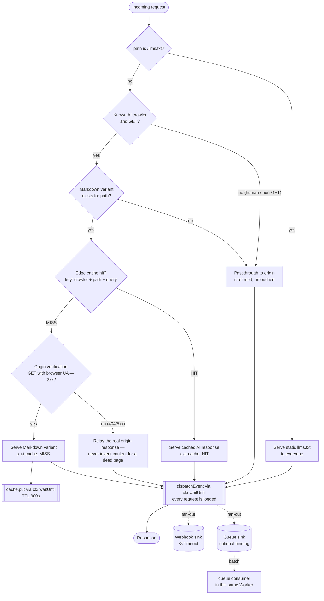
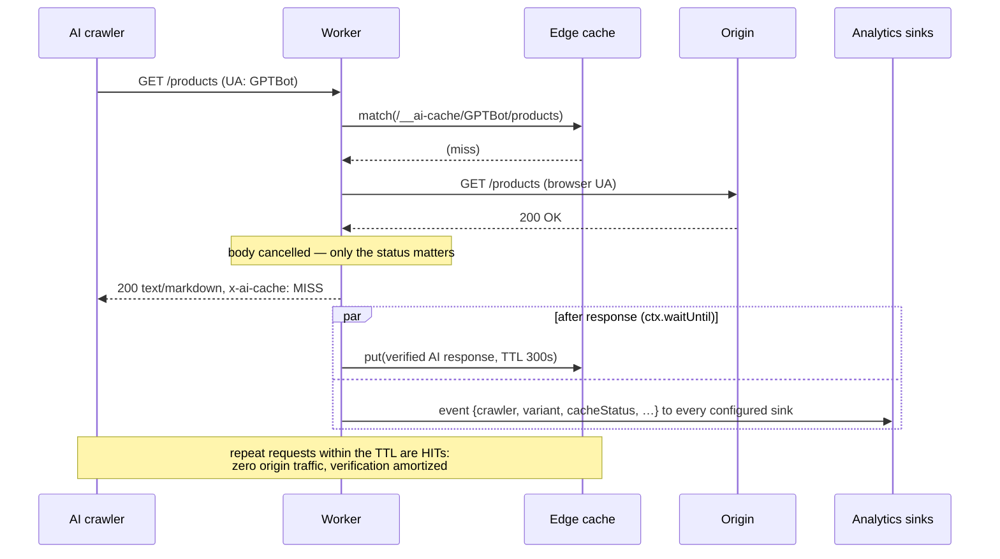
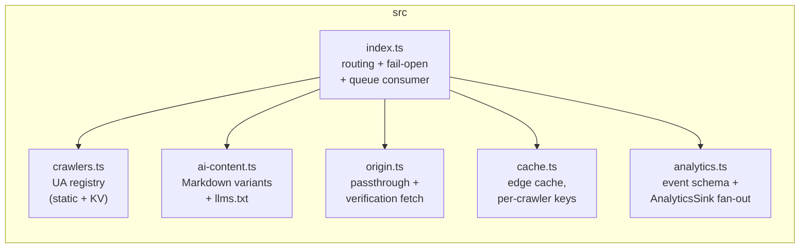

# Architecture

Cloudflare Worker deployed on the zone route in front of
`www.aisearchadvertising.com`. It detects AI crawlers, serves them an
origin-verified, edge-cached Markdown variant, and ships request events to
pluggable analytics sinks — while human traffic streams through untouched.

## Request flow

Fail-open wraps everything above: any unexpected error in the handler falls
back to a transparent passthrough to the origin; only an unreachable origin
yields a 502.

## AI-variant miss path (sequence)

## Modules

| Module | Owns | Never does |
|---|---|---|
| `index.ts` | Request orchestration, fail-open catch, queue consumer | Business logic |
| `crawlers.ts` | Crawler registry + detection | I/O |
| `ai-content.ts` | Markdown variants, `llms.txt`, cache-safety headers | Network calls |
| `origin.ts` | Passthrough + origin verification | Response mutation |
| `cache.ts` | `caches.default` access, cache keys, HIT/MISS marking | Throwing (best-effort by design) |
| `analytics.ts` | Event schema, sink implementations | Blocking or breaking a response |

## Key decisions

**Verify before answering.** An AI variant is only served after the origin
confirms the page exists (a GET with a browser UA whose body is discarded).
A URL that would 404 gets the origin's real 404 — the Worker never invents
content for dead pages. The check costs one origin round-trip, paid at most
once per crawler + path per cache TTL.

**Edge cache keyed by crawler name, not UA string.** Cache keys live under a
synthetic `/__ai-cache/<crawler>/<path>?<query>` namespace, so entries can't
collide with real site URLs, hit rates aren't destroyed by UA version churn,
and `Vary: User-Agent` handling stays out of the cache (it's re-added to
every response leaving the Worker). Cache failures degrade to fresh
verification + generation.

**Sinks are pluggable, delivery is fan-out.** `AnalyticsSink.deliver()` must
never reject; `dispatchEvent()` fans out with `Promise.allSettled` inside
`ctx.waitUntil`, so a broken destination can neither delay the response nor
starve another sink. Shipped sinks: HTTP webhook (3s hard timeout) and an
optional Cloudflare Queue (enable the binding in `wrangler.toml`; this same
Worker consumes the batches).

**Fail open, always.** See README — the Worker sits on the release path of a
live site; its worst case must be "crawler sees the normal HTML page", never
"site is down".
